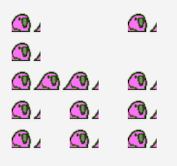

# emoji-banner

Turns text into ascii-art, but then turns the ascii-art into emoji. All you really need is a `:transparent:` custom emoji, for the spacing to work.

# Usage

    ruby play.rb hi

Output:

    :party::transparent::transparent::transparent::party:
    :party::transparent::transparent::transparent::transparent:
    :party::party::party::transparent::party:
    :party::transparent::party::transparent::party:
    :party::transparent::party::transparent::party:
    :transparent::transparent::transparent::transparent::transparent:
    :transparent::transparent::transparent::transparent::transparent:

...which, when rendered with some custom emoji, gives something like this:

Want different emoji?

    ruby play.rb hi love

Outputs:

    :love::transparent::transparent::transparent::love:
    :love::transparent::transparent::transparent::transparent:
    :love::love::love::transparent::love:
    :love::transparent::love::transparent::love:
    :love::transparent::love::transparent::love:
    :transparent::transparent::transparent::transparent::transparent:
    :transparent::transparent::transparent::transparent::transparent:

Alternating letters? Sure:

    ruby play.rb hi love cat

And you get:

    :love::transparent::transparent::transparent::cat:
    :love::transparent::transparent::transparent::transparent:
    :love::love::love::transparent::cat:
    :love::transparent::love::transparent::cat:
    :love::transparent::love::transparent::cat:
    :transparent::transparent::transparent::transparent::transparent:
    :transparent::transparent::transparent::transparent::transparent:

# TODOs

* Extract character maps into...something more manageable.
* Add more fonts?
* Make it run on ruby 2.3.7.
* Add some minitests, for sanity's sake.

# Contributors

* @tara-ted: typography
* @danbernier: ruby hacking
